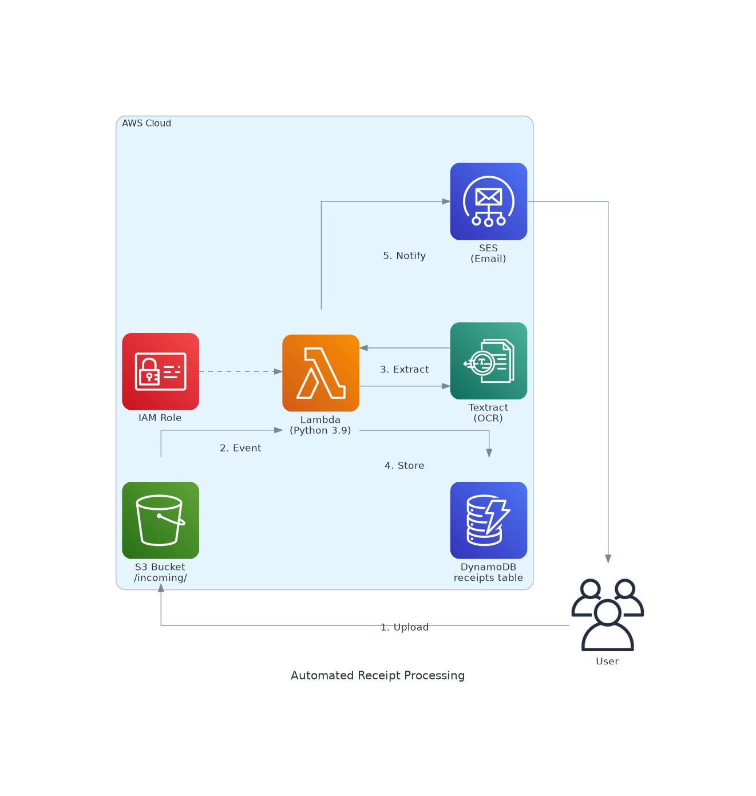

# Automated Receipt Processing System

An AWS-powered serverless solution that automatically processes receipt images using AI/ML services to extract structured data and send email notifications.

## 🏗️ Architecture

The system uses a fully serverless architecture on AWS:

```
Receipt Upload → S3 → Lambda → Textract → DynamoDB → SES → Email
```



## 🚀 Features

- **Automatic Processing**: Upload receipts to S3 and get instant processing
- **AI-Powered OCR**: Uses Amazon Textract for intelligent text extraction
- **Structured Data**: Extracts vendor, date, total amount, and line items
- **Data Storage**: Stores processed data in DynamoDB for future reference
- **Email Notifications**: Sends formatted email summaries via Amazon SES
- **Error Handling**: Robust error handling and logging

## 📁 Project Structure

```
├── lambda-code/
│   └── lambda.py              # Main Lambda function code
├── receipts/
│   └── Report.pdf             # Sample receipt for testing
├── Screenshots/               # UI screenshots and documentation
│   ├── Screenshot (124).png
│   ├── Screenshot (125).png
│   └── ...
├── receipt_processing_architecture.png
├── receipt-processing-architecture.md
└── README.md
```

## 🛠️ Setup & Deployment

### Prerequisites

- AWS Account with appropriate permissions
- AWS CLI configured
- Python 3.9+ runtime environment

### Required AWS Services

1. **Amazon S3** - Receipt storage bucket
2. **AWS Lambda** - Processing function
3. **Amazon Textract** - OCR service
4. **Amazon DynamoDB** - Data storage
5. **Amazon SES** - Email service

### Environment Variables

Configure these environment variables in your Lambda function:

```bash
DYNAMODB_TABLE=Receipts
SES_SENDER_EMAIL=your-sender@example.com
SES_RECIPIENT_EMAIL=your-recipient@example.com
```

### IAM Permissions

The Lambda execution role needs these permissions:

```json
{
  "Version": "2012-10-17",
  "Statement": [
    {
      "Effect": "Allow",
      "Action": [
        "s3:GetObject"
      ],
      "Resource": "arn:aws:s3:::your-bucket/*"
    },
    {
      "Effect": "Allow",
      "Action": [
        "textract:AnalyzeExpense"
      ],
      "Resource": "*"
    },
    {
      "Effect": "Allow",
      "Action": [
        "dynamodb:PutItem"
      ],
      "Resource": "arn:aws:dynamodb:region:account:table/Receipts"
    },
    {
      "Effect": "Allow",
      "Action": [
        "ses:SendEmail"
      ],
      "Resource": "*"
    }
  ]
}
```

## 📊 Data Processing

### Input
- Receipt images (PNG, JPG, PDF)
- Uploaded to designated S3 bucket

### Output
- **Vendor Name**: Business/merchant name
- **Date**: Transaction date
- **Total Amount**: Final receipt total
- **Line Items**: Individual products/services with prices
- **S3 Path**: Original file location

### DynamoDB Schema

```json
{
  "receipt_id": "uuid",
  "date": "YYYY-MM-DD",
  "vendor": "string",
  "total": "string",
  "items": [
    {
      "name": "string",
      "price": "string",
      "quantity": "string"
    }
  ],
  "s3_path": "s3://bucket/key",
  "processed_timestamp": "ISO-8601"
}
```

## 🔧 Usage

1. **Upload Receipt**: Drop receipt image into the configured S3 bucket
2. **Automatic Processing**: Lambda function triggers automatically
3. **Data Extraction**: Textract analyzes the receipt
4. **Storage**: Results saved to DynamoDB
5. **Notification**: Email sent with extracted data

## 📧 Email Notifications

Automated emails include:
- Receipt ID and processing timestamp
- Vendor name and transaction date
- Total amount
- Itemized list of purchases
- S3 location of original receipt

## 📸 Screenshots

.png)
.png)
.png)
.png)
.png)
.png)
.png)

## 🔍 Monitoring & Logging

- CloudWatch Logs for Lambda execution
- Error handling with detailed logging
- Processing status tracking
- Performance metrics

## 🛡️ Security Features

- IAM role-based access control
- Encrypted data storage
- Secure email transmission
- No hardcoded credentials

## 📈 Scalability

- Serverless architecture scales automatically
- Pay-per-use pricing model
- Handles concurrent receipt processing
- No infrastructure management required

## 🔧 Troubleshooting

### Common Issues

1. **Textract Errors**: Ensure image quality and supported formats
2. **Email Failures**: Verify SES configuration and sender verification
3. **DynamoDB Errors**: Check table exists and permissions
4. **S3 Access**: Verify bucket permissions and object existence

### Logs Location
- CloudWatch Logs: `/aws/lambda/your-function-name`

## 🚀 Future Enhancements

- [ ] Multi-language receipt support
- [ ] Receipt categorization
- [ ] Expense reporting dashboard
- [ ] Mobile app integration
- [ ] Batch processing capabilities
- [ ] Advanced analytics and insights

## 📄 License

This project is licensed under the MIT License - see the LICENSE file for details.

## 🤝 Contributing

1. Fork the repository
2. Create a feature branch
3. Commit your changes
4. Push to the branch
5. Create a Pull Request

## 📞 Support

For issues and questions:
- Create an issue in the repository
- Check CloudWatch logs for debugging
- Review AWS service documentation

---

**Built with ❤️ using AWS Serverless Technologies**